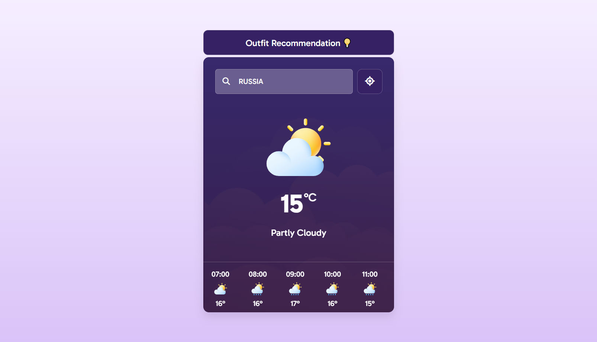
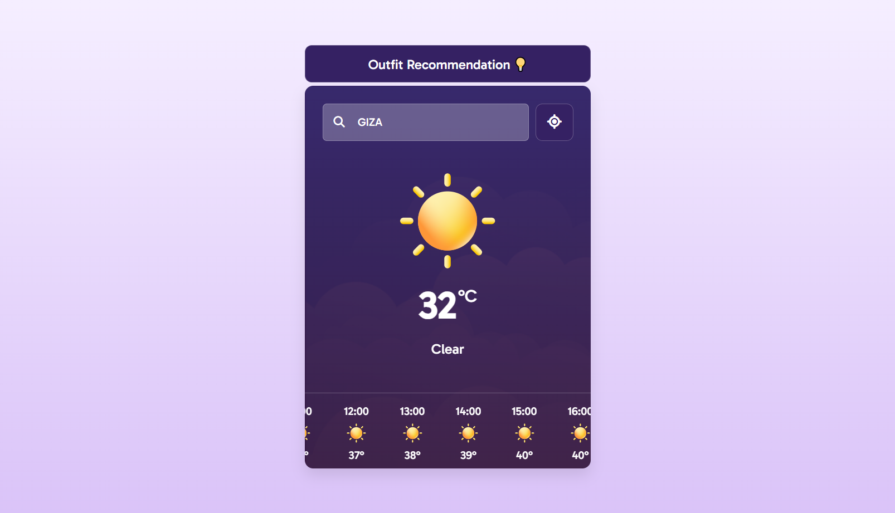
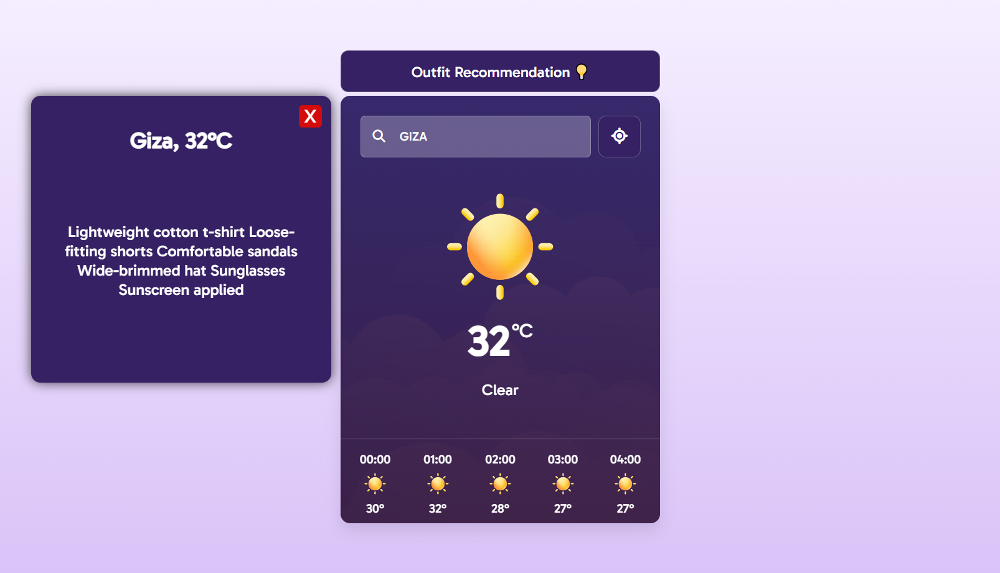
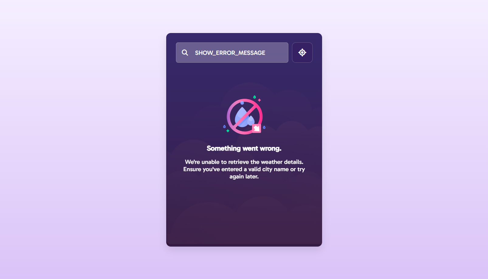

# **☁️ Pluvia - AI-Powered Weather Application**

- **Pluvia** is a clean, responsive, and intelligent weather application that provides users with accurate current weather conditions, detailed hourly forecasts for the next 24 hours, and personalized AI-powered outfit recommendations based on the temperature and location—helping users stay fully prepared, comfortable, and stylish throughout their day within an intuitive and visually appealing interface.

# **🚀 Features**

- 🌤️ **Current Weather Display**: Clearly shows temperature, detailed weather description, and expressive weather icons.
- ⏰ **24-Hour Forecast**: Provides hourly weather updates with temperature and intuitive icons for easy tracking of changes.
- 🤖 **Outfit Recommendations (AI)**: Seamlessly integrated with AI to provide smart outfit suggestions tailored to the current city and temperature.
- 🔍 **City Search**: Quickly and efficiently find accurate weather data for any city worldwide within seconds.
- 💾 **Responsive & Lightweight**: Fast loading, minimal footprint, and highly optimized for all devices and screen sizes.
- ⚠️ **Error Handling**: User-friendly messages and graceful fallback UI if weather data cannot be retrieved or loaded.
- 🎨 **Clean UI**: Intuitive, visually appealing design featuring modern aesthetics and Roboto font for readability.

# **📸 App Screens**

 

 

 

